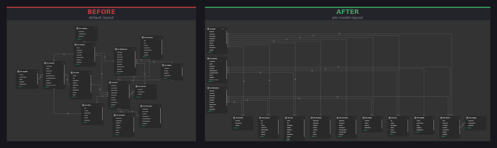
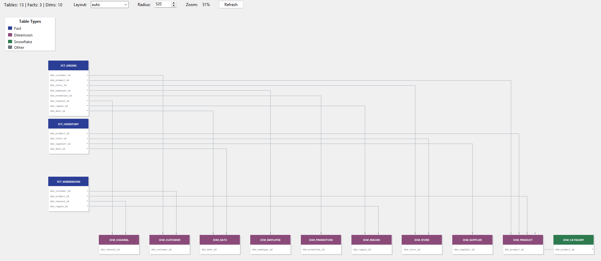

# pbi-model-layout

Automatically arranges Power BI model diagram views into clean, relationship-aware layouts. Detects fact and dimension tables by prefix, reads real node sizes from the `.pbix`, and writes positions back - no manual dragging required.

Available as both a **command-line tool** and a **graphical interface**.
Now also includes a **web application** ready for Azure Web App deployment.

---

## Requirements

- Python 3.9+
- No external packages (stdlib only)

---

## Quick Start

### Option 1: Graphical Interface (Recommended)

```bash
python pbi_layout_gui.py
```

### Option 2: Command Line

```bash
# 1. Extract relationships from your model
python pbix_layout_tool.py --extract-relations your_model.pbit

# 2. Apply the layout
python pbix_layout_tool.py your_model.pbix --relations relations.json
```

Open the generated `your_model_arranged.pbix` in Power BI Desktop.

### Option 3: Web App (Upload `.pbit` and return relations)

```bash
pip install -r requirements.txt
python web_app.py
```

Then open `http://localhost:8000`, upload your `.pbit`, and the UI will return extracted model insights.
The result screen also renders a relationship diagram (SVG) inspired by the GUI layout logic.

API endpoint:

```bash
curl -X POST http://localhost:8000/api/extract-relations \
  -F "file=@demo_model.pbit"
```

Response format:

```json
{
  "file_name": "demo_model.pbit",
  "relationship_count": 13,
  "table_count": 19,
  "measure_count": 42,
  "page_count": 4,
  "visual_count": 21,
  "relations": [
    {
      "from": "fct_Orders",
      "to": "dim_Customer",
      "from_column": "customer_id",
      "to_column": "customer_id"
    }
  ],
  "measures": [
    {
      "table": "fct_Orders",
      "name": "Total Sales",
      "expression": "SUM(fct_Orders[sales_amount])"
    }
  ],
  "pages": [
    {
      "name": "Visão Geral",
      "visual_count": 5
    }
  ],
  "unused": {
    "table_count": 1,
    "measure_count": 3,
    "column_count": 15
  }
}
```



---

## GUI Preview (v1.2)

The preview canvas renders a live Power BI style model view directly in the tool - color-coded table containers, relationship fields, L-shaped connector lines with cardinality symbols and interactive highlights.



The preview above shows a multi-fact model (3 facts, 10 dims, 1 snowflake) rendered with the **auto** layout at 51% zoom. Facts stack on the left; dimension tables line up in a single row below with their fields visible inside each container. L-shaped lines connect fact field rows to the top edges of their dimension tables. Clicking any table highlights it and all directly related tables with a blue border.

---

## GUI Features (v1.2)

### Power BI–Style Preview Canvas

The preview renders your model exactly as it will look in Power BI Desktop's Model View:

- **Color-coded containers** - Blue = Fact, Purple = Dimension, Green = Snowflake, Gray = Other
- **Fields inside containers** - only relationship fields shown (e.g. `dim_customer_id`), sized to fit
- **L-shaped connector lines** - facts exit the right edge, dims are entered from the top, with distributed attachment points so lines never overlap
- **Cardinality symbols** - `*` at the fact side, `1` at the dimension side, drawn on top of containers
- **Legend** - always visible in the top-left corner

### Interactions

- **Zoom** - mouse wheel, 10%–300%, all text and containers scale proportionally
- **Pan** - click and drag the background, smooth pixel-accurate panning
- **Drag tables** - click and drag any table to reposition; positions are cached and used when applying
- **Click a table** - highlights the clicked table (dark blue border) and all directly related tables (light blue border)
- **Click a relationship line** - highlights the line blue and bolds the matching field text in both connected containers
- **Reset Zoom** - returns to the initial zoom-to-fit view

### Layout Modes

Switch between layout strategies using the dropdown in the preview toolbar:

| Mode               | Description                                                        |
| ------------------ | ------------------------------------------------------------------ |
| **auto**           | Smart pick: star for 1 fact, grid for multiple                     |
| **grid**           | Facts stacked left, all dims in a horizontal row below             |
| **horizontal**     | Facts in a row at top, dims in columns below each fact             |
| **star**           | Radial - fact at center, dims in a ring, snowflakes pushed outward |
| **vertical_stack** | Each fact followed immediately by its dims to the right            |

All modes place snowflake tables adjacent to their parent dim (not in a remote row).

### Diagram Tabs

Check **"Create diagram tabs"** in the GUI (or use `--create-tabs` on the CLI) to generate focused views - one tab per fact table:

- **Diagram 0** (master): All tables in chosen layout
- **Diagram 1–N**: One per fact, showing only that fact + connected dims in a star layout

Switch tabs using the diagram selector in Power BI Desktop's Model View (bottom-left corner).


---

## How to get the `.pbit`

In Power BI Desktop: **File → Save As → Power BI Template (.pbit)**

The `.pbit` is a ZIP containing a human-readable `DataModelSchema` with all relationships. The extractor reads it automatically and writes `relations.json`.

---

## Layout Modes Explained

### Auto Mode

Picks the best layout for your model:

- **Single fact** → Star (fact center, dims in ring)
- **Multiple facts** → Grid (facts left column, dims below)

### Grid Layout

```
fct_Orders
fct_Inventory     dim_A  dim_B  dim_C  ...  dim_Parent  dim_Child
fct_WebSessions
```

### Horizontal Layout

Facts across the top, each fact's dims stacked in a column below it. Snowflake children placed directly below their parent dim.

### Star Layout

Fact at center, dims radiate outward in a ring. Snowflake children pushed further out along the same angle as their parent dim. For multiple facts, creates a 2-column grid of star clusters.

### Vertical Stack

Each fact followed immediately by its dims in a row to the right. Snowflake children placed inline after their parent dim. Orphan dims collected below.

---

## Command-Line Options

| Flag                   | Default                 | Description                                  |
| ---------------------- | ----------------------- | -------------------------------------------- |
| `--output FILE`        | `input_arranged.pbix`   | Output path                                  |
| `--relations FILE`     | -                       | Path to `relations.json`                     |
| `--fact-prefixes`      | `fct_,fact_,FCT_,FACT_` | Comma-separated fact table prefixes          |
| `--dim-prefixes`       | `dim_,DIM_,Dim_,d_,D_`  | Comma-separated dim table prefixes           |
| `--radius N`           | `520`                   | Star layout: radius from fact to dim ring    |
| `--create-tabs`        | -                       | Generate focused diagram tabs (one per fact) |
| `--extract-relations`  | -                       | Extract relationships from a `.pbit`         |
| `--generate-relations` | -                       | Print a blank `relations.json` template      |
| `--dry-run`            | -                       | Print layout plan without writing anything   |

---

## `relations.json` Format

```json
[
  { "from": "fct_Orders", "to": "dim_Customer" },
  { "from": "fct_Orders", "to": "dim_Product" },
  { "from": "dim_Product", "to": "dim_Category" }
]
```

`"from"` is the many-side (fact or parent dim), `"to"` is the one-side (dim or child dim). Direction is for readability only - the tool infers roles from prefixes.

---

## Workflow

1. **Extract relationships**
   - Open the GUI and use Step 1 or run `--extract-relations` on your `.pbit`
   - Generates `relations.json`

2. **Preview and adjust**
   - Select your `.pbix` and `relations.json` in the GUI
   - Click **Preview Layout**
   - Try different layout modes, zoom in/out, drag tables to fine-tune
   - Click any table to see its relationships highlighted

3. **Apply**
   - Click **Apply This Layout** (from preview) or **Apply Layout** (from main window)
   - Output written to `*_arranged.pbix`
   - Open in Power BI Desktop → Model View

---

## Changelog

### v1.2 (current)

- 🎨 **Power BI–style preview canvas** - containers with fields, L-shaped connector lines, cardinality symbols (`*` / `1`)
- 🖱️ **Table click highlight** - click a table to highlight it and all directly related tables
- 🔵 **Line click highlight** - click a relationship line to highlight it and the matching fields in both containers
- 🔍 **Zoom-to-fit on open** - preview always opens with all tables visible
- 🧊 **Smooth pan** - pixel-accurate panning via `xview_moveto` / `yview_moveto`
- ❄️ **Snowflake placement** - all layout modes now place snowflake children adjacent to their parent dim
- 📐 **Dynamic container sizing** - container width and height computed from table name length and field count

### v2.1 / v1.1

- Tkinter GUI with 5 layout algorithms
- Interactive drag-and-drop positioning
- Zoom/scroll controls
- Two-step extract-then-apply workflow

---

## Files

| File                       | Description                               |
| -------------------------- | ----------------------------------------- |
| `pbix_layout_tool.py`      | Core layout engine + CLI                  |
| `pbi_layout_gui.py`        | Graphical interface (v1.2)                |
| `web_app.py`               | Flask web app for `.pbit` upload/extract  |
| `templates/index.html`     | Web UI                                    |
| `Procfile`                 | Azure/App Service startup command         |
| `requirements.txt`         | Web dependencies                           |
| `layout_preview.png`       | Preview canvas screenshot                 |
| `before_and_after.png`     | Before/after model view comparison        |
| `demo_model.pbix`          | Sample Power BI model                     |
| `demo_model.pbit`          | Sample template (for relation extraction) |
| `demo_model_arranged.pbix` | Sample output                             |
| `data/`                    | Sample data used in demo model            |

---

## Deploy to Azure Web App (Linux)

1. Create an App Service (Python runtime).
2. Deploy this repository (GitHub Actions, local git, or zip deploy).
3. Ensure startup command uses the included Procfile:
   - `gunicorn --bind 0.0.0.0:$PORT web_app:app`
4. The app will expose:
   - `GET /` (upload UI)
   - `POST /api/extract-relations` (JSON API)
   - `GET /health` (health check)

## License

MIT
